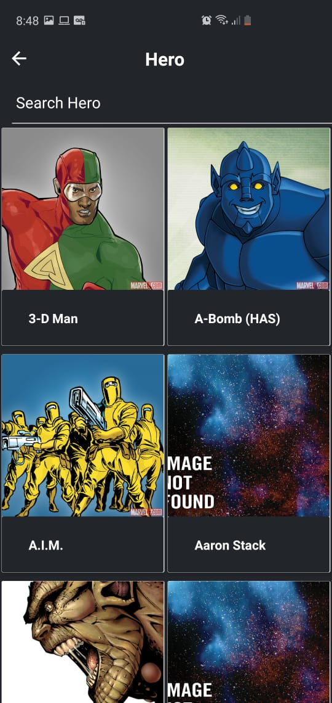
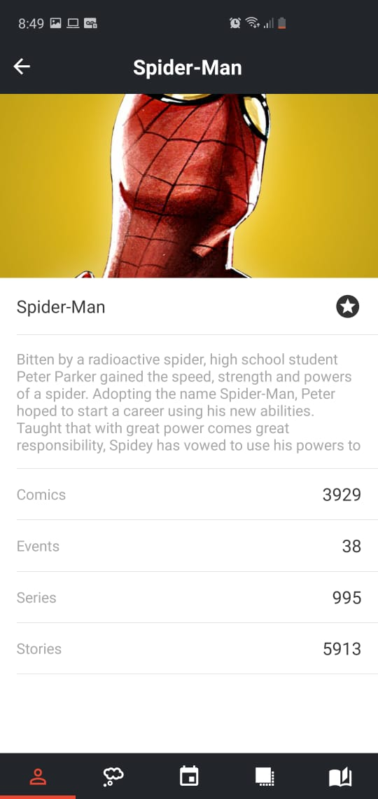
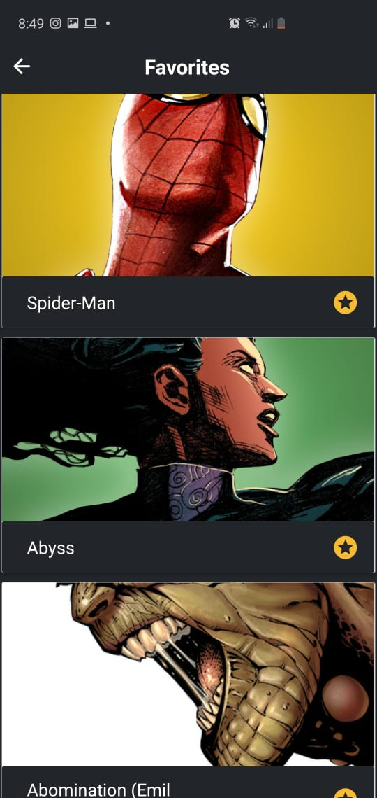

<h1 align="center">
<br>
  
<br>
<br>
</h1>

<p align="center">
  
  
  
  
  
</p>

<!-- O que é: -->

## O que é o Marvel Herois?

Marvel Herois é um aplicativo destinado a fans de bilheteria dos super herois mais queridos
do cinema, com ele você consegue estar mais proximo de todos seus herois, conhecer suas histórias, eventos,
quadrinhos e muito mais.

<!-- Tecnologias: -->

## Tecnologias Utilizadas?

- **React-native:** - Framework utilizado no desenvolvimento da aplicação
- **Redux:** Biblioteca utilizada para controlar o estado da aplicação.
- **Axios:** Cliente HTTP baseado em promessas para conecção com a api.
- **Eslint:** Ferramenta de análise de codigo mantendo os padrões configurados para aplicação.
- **Ramda:** Biblioteca funcional JavaScript.

<!-- Links: -->

## Links

**React-native:** (https://facebook.github.io/react-native/)

- **Redux:** (https://redux.js.org/)
- **Axios:** (https://github.com/axios/axios)
- **Eslint:** (https://eslint.org/)
- **Ramda:** (https://ramdajs.com/)

---

<!-- Primeiros passos / Instalação: -->

## Instalação / Configuração

Pré-requisitos: Para rodar o projeto react-native em seu celular ou emulador você precisa de algumas
configurações mais especificas, recomendo este link
(https://facebook.github.io/react-native/docs/getting-started) caso ainda não possua as configurações recomendadas em sua maquina.

1. Instale
   [Git](http://git-scm.com/downloads) e
   [NodeJS](http://nodejs.org/download/),
   caso você não os tenha ainda.

2. Clone o repositório:

   ```sh
   $ git clone git://github.com/hyankelwin/MarvelHero.git
   ```

3. Vá para pasta do projeto:

   ```sh
   $ cd marvel
   ```

4. Instale todas as dependências:

   ```sh
   $ npm install ou yarn
   ```

5. E finalmente rode:

   ```sh
   $ react-native run-android (Android)
   ou
   $ react-native run-ios (IOS)
   ```

   Agora você irá ver o aplicativo rodando em seu celular ou emulador :D

<!-- Criado por: -->

## Quem está por trás disso?

Um desenvolvedor apaixonado pela programação e tecnologias.

**Criado por**:

- [Hyan Kelwin](http://github.com/hyankelwin)
