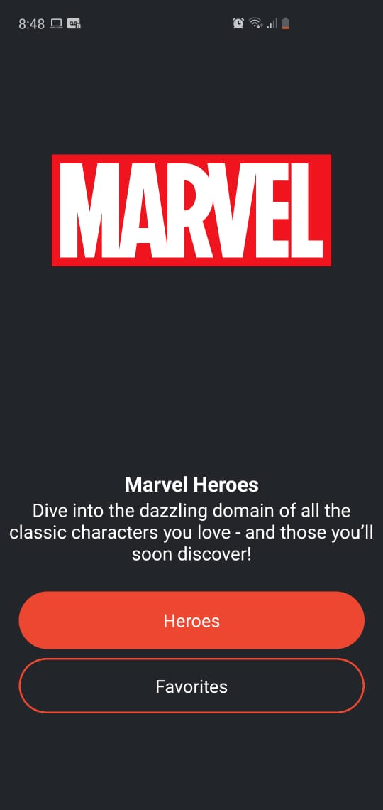

<h1 align="center">
<br>
  
<br>
<br>
</h1>

<p align="center">
  
  
  
  
  
</p>

<!-- What is: -->

## What is Marvel Heroes?

Marvel Herois is an app aimed at box office fans of the most beloved superheroes
of cinema, with it you can be closer to all your heroes, know their stories, events,
comics and more.

<!-- Tecnologics: -->

## Technologies Used?

- **React-native:** - Framework used in application development.
- **Redux:** Library used to control application status.
- **Axios:** Http client based on promises for connection with api.
- **Eslint:** Code analysis tool keeping the standards configured for application.
- **Ramda:** Functional library JavaScript.

<!-- Links: -->

## Links

**React-native:** (https://facebook.github.io/react-native/)

- **Redux:** (https://redux.js.org/)
- **Axios:** (https://github.com/axios/axios)
- **Eslint:** (https://eslint.org/)
- **Ramda:** (https://ramdajs.com/)

---

<!-- Get Started / Install: -->

## Getting started

Prerequisites: To run the react-native project on your mobile or emulator you need some
more specific settings, I recommend this link
(https://facebook.github.io/react-native/docs/getting-started) if you do not already have the recommended settings on your machine.

1. Install
   [Git](http://git-scm.com/downloads) e
   [NodeJS](http://nodejs.org/download/),
   in case you don't have them yet.

2. Clone repository:

   ```sh
   $ git clone git://github.com/hyankelwin/MarvelHero.git
   ```

3. Go to project folder:

   ```sh
   $ cd marvel
   ```

4. Install all dependences:

   ```sh
   $ npm install ou yarn
   ```

5. Finally run:

   ```sh
   $ react-native run-android (Android)
   ou
   $ react-native run-ios (IOS)
   ```

   Now you will see the app running on your mobile phone or emulator :D

<!-- Create by: -->

## Who's behind this?

Developer passionate about programming and technologies.

**Create by**:

- [Hyan Kelwin](http://github.com/hyankelwin)
